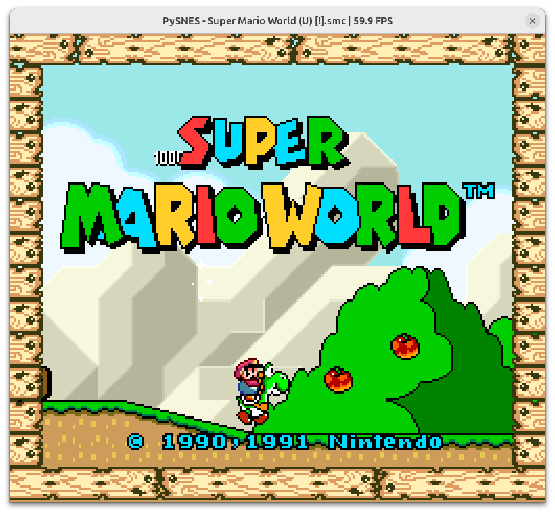

# PySNES

A Super Nintendo Entertainment System (SNES) emulator written in Python. Work in progress.



## Features

- **CPU**: WDC 65816 implementation
- **PPU**: Background and sprite rendering with color math, windowing, and mosaic effects
- **APU**: SPC700 processor and DSP for audio playback
- **DMA / HDMA**: General-purpose and H-blank DMA transfers
- **Controllers**: Standard joypad input via SDL2
- **Debugger**: Built-in debugger with breakpoint support
- **Save states**: Save and restore game state

## Requirements

- [uv](https://docs.astral.sh/uv/) (Python package manager)
- PyPy 3.10 (installed automatically by uv)
- SDL2 runtime library

Install SDL2 on Debian/Ubuntu:

```sh
sudo apt install libsdl2-2.0-0
```

## Running

```sh
uv run pysnes roms/game.sfc
```

## Controls

### Gamepad

| Key | Button |
|-----|--------|
| Arrow keys | D-pad |
| Z | B |
| X | A |
| A | Y |
| S | X |
| Enter | Start |
| ' (apostrophe) | Select |
| D | L |
| C | R |

### Emulator

| Key | Action |
|-----|--------|
| Space | Pause / resume |
| F5 | Save state |
| F6 | Load state |
| F11 | Screenshot |
| F12 | Open debugger |

## Development

### Running tests

```sh
uv run pytest
```

### Project structure

```
pysnes/
  cpu/        WDC 65816 CPU and DMA
  ppu/        Picture processing unit (rendering)
  apu/        Audio processing unit (SPC700 + DSP)
  bus/        Memory bus and address decoding
  rom/        ROM loading and header parsing
  controller/ Joypad input
  debugger/   Built-in debugger
  savestate/  Save/load state
  video/      SDL2 display output
  audio/      SDL2 audio output
```
